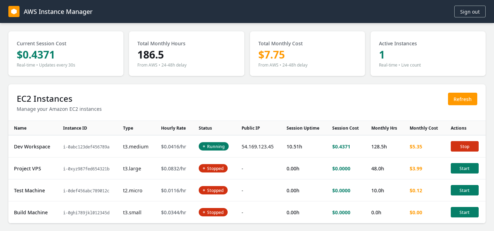

# AWS Instance Management

A simple web application to manage AWS EC2 instances and save money on remote development or VPS costs.



## Why This Project?

Running EC2 instances 24/7 on AWS can be expensive. This tool helps you save money by making it easy to:
- Start your VPS only when you need to use it
- Stop your VPS when you're not using it
- Track your usage hours and costs

Instead of paying for 720+ hours per month (24/7 operation), you only pay for the hours you actually use.

## Features

- **Simple Dashboard**: View all your EC2 instances at a glance
- **One-Click Control**: Start and stop instances with a single click
- **Cost Tracking**:
  - Real-time session cost (from start to current time)
  - Monthly usage hours and costs
  - Hourly pricing rates (automatically fetched from AWS)
- **Multi-Platform Support**: Automatically detects and prices Linux and Windows instances correctly
- **Secure**: Password-protected with server-side authentication

## Prerequisites

- Node.js (v18 or higher)
- AWS Account with EC2 instances
- AWS IAM credentials with the following permissions:
  - `ec2:DescribeInstances`
  - `ec2:StartInstances`
  - `ec2:StopInstances`
  - `ce:GetCostAndUsage`
  - `pricing:GetProducts`

## Installation

1. Clone the repository:
```sh
git clone <your-repo-url>
cd aws-instance-management
```

2. Install dependencies:
```sh
npm install
```

3. Create a `.env` file in the root directory:
```env
# Authentication Password
AUTH_PASSWORD=your-secure-password

# Session Secret (change this to a random string)
SESSION_SECRET=your-random-secret-key

# AWS Credentials
AWS_ACCESS_KEY_ID=your-aws-access-key
AWS_SECRET_ACCESS_KEY=your-aws-secret-key
AWS_REGION=ap-southeast-1
```

4. Start the development server:
```sh
npm run dev
```

5. Open your browser and navigate to `http://localhost:5173`

## Building for Production

To create a production build:

```sh
npm run build
```

Preview the production build:

```sh
npm run preview
```

## How It Works

1. **Login**: Enter your password to access the dashboard
2. **View Instances**: See all your EC2 instances with their current status
3. **Control**: Click "Start" or "Stop" to manage your instances
4. **Monitor Costs**:
   - **Session Cost**: Real-time calculation from when the instance started
   - **Monthly Hours/Cost**: Historical data from AWS (24-48h delay)
   - **Hourly Rate**: Accurate pricing from AWS Pricing API

## Cost Savings Example

If you use a `t3.medium` instance ($0.0416/hour in Singapore):
- **24/7 Operation**: 720 hours/month = $29.95/month
- **8 Hours/Day**: 240 hours/month = $9.98/month
- **Savings**: $19.97/month (67% reduction)

## Technology Stack

- **Frontend**: SvelteKit with Tailwind CSS
- **Backend**: SvelteKit API routes
- **AWS SDK**:
  - `@aws-sdk/client-ec2` - Instance management
  - `@aws-sdk/client-cost-explorer` - Monthly billing data
  - `@aws-sdk/client-pricing` - Accurate hourly rates

## Security Notes

- All AWS operations are performed server-side
- Session authentication using HTTP-only cookies
- No AWS credentials exposed to the client
- Password stored in environment variable

## License

MIT
